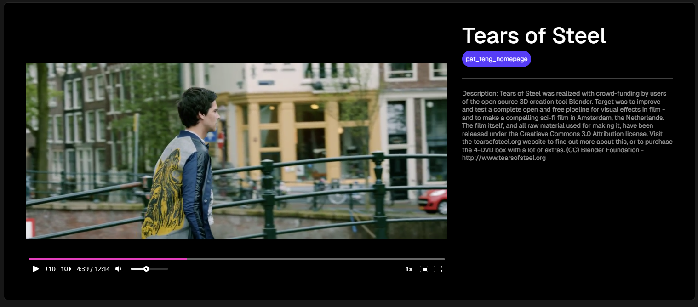
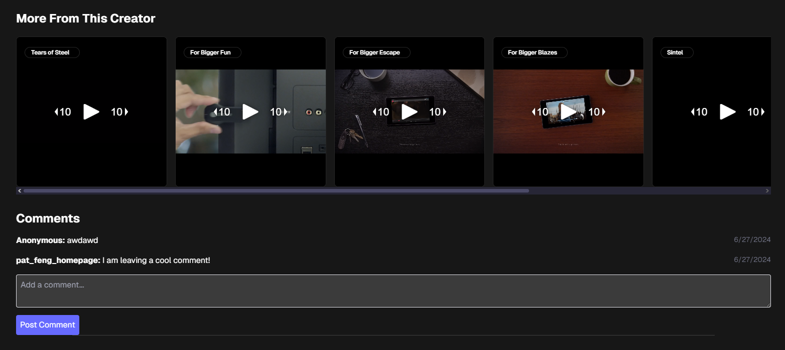
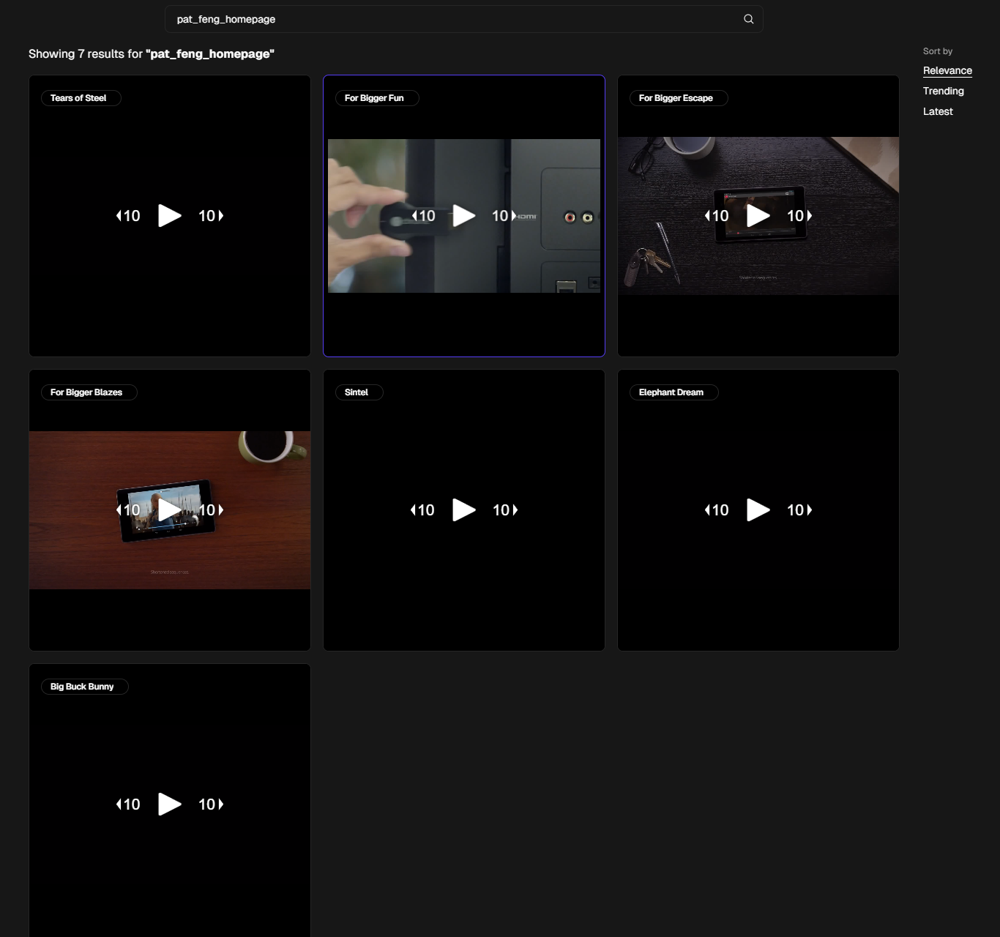

# Learnwell Demo App

A video platform for posting and commenting on videos:

https://github.com/patfeng/videoApp/assets/33937132/0404c061-6b11-4e72-b884-b51b08c058a7

Or watch here: https://www.loom.com/share/110c8980ec7146ff968445d56ece297a?sid=0f3b58f1-04c9-4e08-beb1-4b852d8c8154

## Features

Next-video powered video player:

Recommended videos and comment section:

Video Posting and Preview:

Search by username in the navbar:

## Setup

1. Clone this repository
2. Copy .env.example into .env.local
3. Run `npx pnpm install`
4. Run `npm pnpm build`
5. Run `npm pnpm start`

## Tech Stack

- Next.js
- Redux

